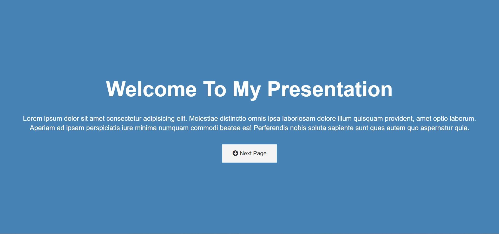
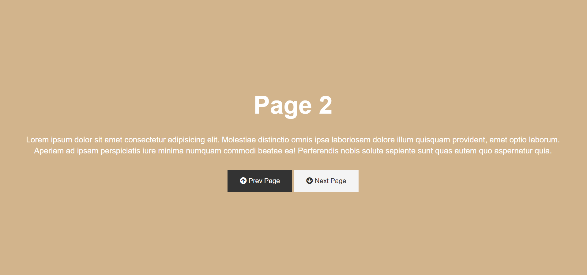

# Presentation-website
This is a Presentation Website created using HTML, CSS. In this Website I deep dived into css topics like animations, keyframes, transitions, properties like transform, etc. I got to learn a lot and the project was quite fun to develop.
Feel free to get ideas.

## Developed By 
> Nishkarsh Dubb

## Screenshots 📷

## Live Demo 

 [https://nishkarsh01.github.io/presentation-website/](https://nishkarsh01.github.io/presentation-website/)

## Developed Using 💻

+ [Html](https://developer.mozilla.org/en-US/docs/Web/HTML)
+ [Css](https://developer.mozilla.org/en-US/docs/Web/CSS)

## Installation or Getting Started

Run the following command in the terminal:

	git clone https://github.com/Nishkarsh01/presentation-website.git
or download the zip file from github.
    

## Usage
After extracting the files,

    cd presentation-website/
    open index.html

## Collaborate
To collaborate, reach us on [nishdubb11@gmail.com]()

## Further help/Reference

+ [MDN Web Docs](https://developer.mozilla.org/en-US/)
+ [w3schools.com](https://www.w3schools.com/)
    

